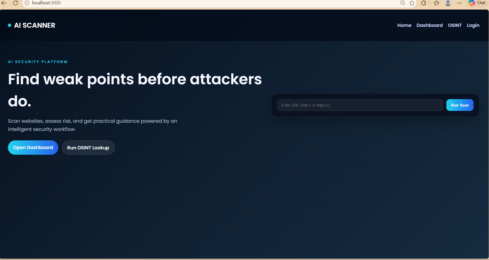
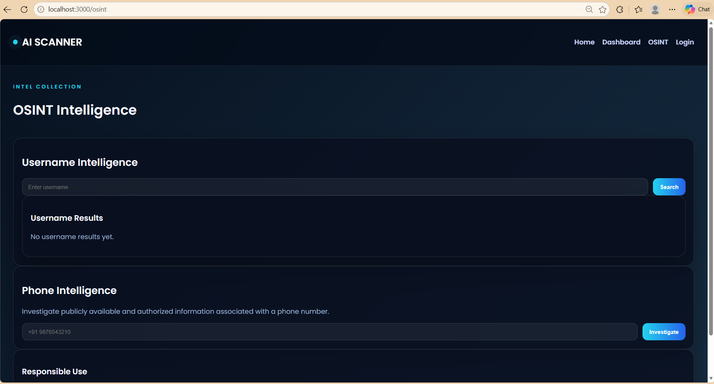
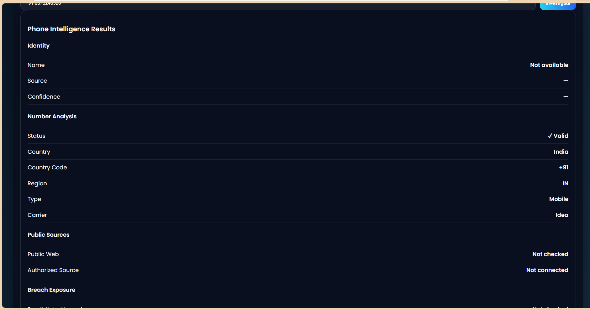

2f55e787-9deb-4ec7-9e81-0469f1039f2f.png
yhi live kiya hu

b5193703-eab5-4b1f-b49c-ca38ec1611a4.png

e3d483be-58da-4a74-87d5-971db483eaa2.png
isme kidhar add kru

1442d61b-b4b2-4614-b7df-93401d8eee43.png

562766a8-ef9f-45bd-be10-52101b698404.png

0a1d7e4e-39ea-42fa-acab-150c1f8d1458.png

9037a4fb-5e0d-4457-976f-9d083947c6bc.png
kya fayda fir 

Bilkul. Is baar README ko proper GitHub portfolio/project level pe bana dete hain—clean, professional, detailed, aur jo features tumhare project me actually hain sirf wahi claim karenge.

Apne current README.md ko poora replace karke ye paste karo:

# 🛡️ AI Scanner

<p align="center">
  <strong>AI-powered Security Scanning & OSINT Intelligence Platform</strong>
</p>

<p align="center">
  A full-stack cybersecurity project built with React.js, Flask, Python and SQLite for authorized security testing, website analysis and public OSINT research.
</p>

<p align="center">
  <a href="https://ai-scanner-frontend-7yt8.onrender.com/">
    🌐 Live Demo
  </a>
</p>

---

## 🚀 Live Application

### 🌐 AI Scanner

**Live Website:**  
https://ai-scanner-frontend-7yt8.onrender.com/

The application provides a web-based interface for:

- Website security scanning
- Username OSINT
- Phone number intelligence
- Security findings
- Risk-based dashboard
- Authentication
- Structured intelligence reports

> The application is intended for educational purposes and authorized security testing only.

---

# 📌 About The Project

**AI Scanner** is a full-stack cybersecurity and OSINT platform designed to provide a centralized interface for security analysis and intelligence gathering.

The project combines a modern React frontend with a Python Flask backend and provides a dashboard-based workflow for security scanning and OSINT investigation.

The main goal of the project is to learn and demonstrate practical concepts in:

- Cybersecurity
- Web security
- OSINT
- REST API development
- Full-stack development
- Authentication
- Data processing
- Security reporting
- Cloud deployment

---

# ✨ Key Features

## 🔍 1. Website Security Scanner

AI Scanner provides a web interface where users can submit a website URL for security analysis.

The scanner is designed to help identify security-related information and organize findings into a readable report.

### Features

- URL-based scanning
- Security findings
- Risk classification
- Structured scan results
- Dashboard reporting
- Recent scan tracking

### Risk Levels

Findings can be organized into:

- 🔴 High Risk
- 🟠 Medium Risk
- 🟢 Low Risk

The dashboard provides a quick overview of identified findings.

---

# 🕵️ 2. OSINT Intelligence

The OSINT section provides tools for researching publicly available information.

The project currently supports:

### 👤 Username Intelligence

Users can enter a username and check supported public platforms.

Results can include:

- Platform name
- Profile URL
- Found / Not Found status
- Username intelligence information

Example:

```text
Username: example_user

Platform       Status
-------------------------
GitHub         Found
Instagram      Not Found
Twitter/X      Found
The actual results depend on the supported checks and availability of the public platform.

📱 3. Phone Intelligence
AI Scanner includes a phone intelligence module for analyzing phone numbers.

The current implementation uses Google's libphonenumber library for structured phone-number analysis.

Current capabilities
Phone number validation

Country detection

Country code

Region

Number type

Carrier information

International formatting

National formatting

Example:

PHONE INTELLIGENCE

Number
+91 XXXXX XXXXX

Number Analysis
-------------------------
✓ Valid
Country        India
Country Code   +91
Region         IN
Type           Mobile
Carrier        Available when provided
Identity Information
The application does not guess the identity of a phone-number owner.

A subscriber name is displayed only when information is obtained from a legitimate:

Public source

Authorized data provider

Authorized integration

If no legitimate source provides the information, the application displays:

Name: Not available
This prevents the system from presenting guessed or unverified personal information as fact.

🔐 Responsible OSINT
AI Scanner follows a responsible-use approach.

The platform is intended for:

Educational cybersecurity research

Security learning

Authorized penetration testing

Personal security investigation

Public-information OSINT

Systems and accounts that the user owns or has permission to investigate

The project should NOT be used for:
Unauthorized access

Stalking or harassment

Tracking individuals without authorization

Accessing private information

Credential theft

Bypassing authentication

Exploiting systems without permission

Collecting non-public personal information

Always follow applicable laws, platform policies and responsible disclosure practices.

📊 Security Dashboard
The dashboard provides a centralized view of security activity.

It includes:

Risk Overview
┌─────────────────────────────────────┐
│          SECURITY OVERVIEW           │
├─────────────────────────────────────┤
│ 🔴 High Risk                         │
│ 🟠 Medium Risk                       │
│ 🟢 Low Risk                          │
└─────────────────────────────────────┘
Dashboard functionality
Security risk overview

Recent targets

Scan information

Security reports

Risk classification

The dashboard is designed to make security findings easier to understand.

🔑 Authentication
AI Scanner includes an authentication system for application users.

Supported functionality
User registration

User login

Authentication token handling

Protected API requests

Logout

The frontend communicates with the Flask backend through REST APIs.

🏗️ System Architecture
The application follows a frontend/backend architecture.

                         ┌──────────────────────┐
                         │      User / Browser   │
                         └──────────┬───────────┘
                                    │
                                    ▼
                         ┌──────────────────────┐
                         │    React Frontend    │
                         │                      │
                         │  Home                │
                         │  Dashboard           │
                         │  OSINT               │
                         │  Login / Register    │
                         └──────────┬───────────┘
                                    │
                              REST API
                                    │
                                    ▼
                         ┌──────────────────────┐
                         │    Flask Backend     │
                         │                      │
                         │  Authentication     │
                         │  Website Scanner     │
                         │  OSINT Routes       │
                         │  Phone Intelligence │
                         └──────────┬───────────┘
                                    │
                   ┌────────────────┼────────────────┐
                   │                │                │
                   ▼                ▼                ▼
              ┌─────────┐     ┌────────────┐   ┌──────────────┐
              │ SQLite  │     │ OSINT      │   │ libphonenumber│
              │Database │     │ Services   │   │   Analysis    │
              └─────────┘     └────────────┘   └──────────────┘
🛠️ Technology Stack
Frontend
React.js

JavaScript

HTML5

CSS3

Fetch API

Backend
Python

Flask

Flask Blueprint

REST APIs

Database
SQLite

Security / OSINT
Google libphonenumber

Public OSINT checks

Website security analysis

Development Tools
Visual Studio Code

Git

GitHub

npm

Python Virtual Environment

Deployment
Render

GitHub

📁 Project Structure
AI Scanner
│
├── backend/
│   │
│   ├── models/
│   │
│   ├── routes/
│   │   └── osint.py
│   │
│   ├── services/
│   │
│   ├── tests/
│   │
│   ├── utils/
│   │
│   ├── app.py
│   ├── config.py
│   ├── database.db
│   └── requirements.txt
│
├── database/
│
├── frontend/
│   │
│   ├── public/
│   │
│   ├── src/
│   │   │
│   │   ├── components/
│   │   │   ├── Navbar.js
│   │   │   ├── ReportCard.js
│   │   │   └── ScanForm.js
│   │   │
│   │   ├── pages/
│   │   │   ├── Dashboard.js
│   │   │   ├── Home.js
│   │   │   ├── Login.js
│   │   │   ├── OSINT.js
│   │   │   └── Register.js
│   │   │
│   │   └── services/
│   │       ├── api.js
│   │       └── auth.js
│   │
│   ├── build/
│   └── package.json
│
├── .gitignore
├── render.yaml
├── README.md
└── ...
🔌 API Endpoints
The frontend communicates with the Flask backend through REST APIs.

Authentication
Register
POST /api/auth/register
Request:

{
  "email": "user@example.com",
  "password": "your-password"
}
Login
POST /api/auth/login
Request:

{
  "email": "user@example.com",
  "password": "your-password"
}
🔎 Website Scanner
Endpoint
POST /api/scan/
Request:

{
  "url": "https://example.com"
}
The backend processes the submitted target and returns structured scan information.

Only scan websites that you own or have explicit permission to test.

👤 Username OSINT
Endpoint
POST /api/osint/username
Request:

{
  "username": "example_user"
}
Example response structure:

{
  "accounts": [],
  "intelligence": {}
}
📱 Phone Intelligence API
Endpoint
POST /api/osint/phone
Request:

{
  "phone": "+919876543210"
}
Example response:

{
  "number": "+91 98765 43210",

  "identity": {
    "name": null,
    "source": null,
    "confidence": null
  },

  "number_analysis": {
    "valid": true,
    "country": "India",
    "country_code": "+91",
    "region": "IN",
    "type": "Mobile",
    "carrier": "Available when provided"
  },

  "public_sources": {
    "public_web": {
      "status": "Not checked",
      "matches": []
    },

    "authorized_source": {
      "status": "Not connected",
      "matches": []
    }
  },

  "breach_exposure": {
    "status": "Not checked",
    "email_linked": false
  }
}
🧪 Local Installation
Follow the steps below to run AI Scanner locally.

1. Clone the Repository
git clone https://github.com/YOUR_USERNAME/YOUR_REPOSITORY.git
Move into the project:

cd YOUR_REPOSITORY
🐍 Backend Setup
Go to the backend directory:

cd backend
Create a virtual environment:

python -m venv .venv
Activate it on Windows:

.venv\Scripts\activate
Install dependencies:

pip install -r requirements.txt
Run the Flask backend:

python app.py
The backend will start on the configured Flask port.

⚛️ Frontend Setup
Open a new terminal.

Move into the frontend directory:

cd frontend
Install dependencies:

npm install
Start the development server:

npm start
The React application will normally be available at:

http://localhost:3000
⚙️ Environment Variables
Environment variables should be used for configuration and sensitive values.

Example:

REACT_APP_API_URL=http://localhost:5000
Security
Never commit:

API keys

Passwords

Authentication secrets

Private tokens

Database credentials

Production secrets

to GitHub.

Make sure .env is included in .gitignore.

🧪 Testing Checklist
Before deploying changes, test the following.

Authentication
 Registration works

 Login works

 Logout works

 Invalid credentials are handled

 Protected API requests work

Website Scanner
 Valid URL

 Invalid URL

 Scan request

 Scan response

 Error handling

 Dashboard results

Username OSINT
 Username search

 Empty username validation

 Results display

 API failure handling

Phone Intelligence
 Valid phone number

 Invalid phone number

 Country detection

 Country code

 Region

 Number type

 Carrier information

 Error handling

Production
 Frontend deployed

 Backend deployed

 API connected

 Environment variables configured

 No secrets committed

 Production API tested

🔒 Security Considerations
AI Scanner is a cybersecurity learning project, so security itself is an important part of the development process.

Potential production improvements include:

API rate limiting

Strong password hashing

Secure token handling

HTTPS enforcement

Input validation

Input sanitization

CSRF protection where applicable

API authorization

Abuse prevention

Request logging

Security monitoring

Error handling without exposing sensitive details

Database security

Secret management

🗺️ Development Roadmap
✅ Completed
 React frontend

 Flask backend

 Authentication

 Login and registration

 Security dashboard

 Website scanner interface

 Username OSINT

 Phone intelligence

 Phone validation

 Country detection

 Region detection

 Number type detection

 Carrier information

 REST API integration

 Render deployment

 GitHub integration

🚧 In Development
 Public web source detection

 Public source evidence

 Authorized identity-source integration

 Improved OSINT results

 Better confidence reporting

 Improved scan reports

🔮 Future Plans
 Scan history

 Exportable PDF reports

 Advanced website security checks

 Improved vulnerability reporting

 Security report sharing

 API rate limiting

 Advanced authentication

 Security monitoring

 Improved OSINT source management

📸 Screenshots
Screenshots can be added to the repository using a screenshots directory.

Example:

screenshots/
├── home.png
├── dashboard.png
├── osint.png
└── phone-intelligence.png
Then add them to this README:

Home

Dashboard

OSINT

Phone Intelligence

🎯 Project Objectives
The project was created to gain practical experience in full-stack cybersecurity development.

Main learning objectives
Frontend Development

React component architecture

State management

API integration

Responsive UI

Dashboard design

Backend Development

Flask

REST APIs

Route organization

Request validation

Error handling

Cybersecurity

Website security concepts

OSINT

Information gathering

Risk classification

Responsible security testing

Deployment

Git

GitHub

Render

Environment configuration

Production debugging

💡 Why This Project?
Modern cybersecurity workflows often require information from multiple sources.

AI Scanner aims to provide a single interface where security researchers can:

Submit a target for authorized analysis

Review security findings

Investigate public usernames

Analyze phone-number metadata

Review structured intelligence

Understand potential security risks

The project is also intended as a practical learning project for understanding how cybersecurity tools can be built using full-stack technologies.

👨‍💻 Author
Suman Kumar
B.Tech CSE (AI & Data Science)

Areas of Interest
🤖 Artificial Intelligence

🧠 Machine Learning

🌐 Full-Stack Development

📊 Data Science

🔐 Cybersecurity

🕵️ OSINT

🐍 Python

🌐 Connect
GitHub: https://github.com/suman9834

LinkedIn: https://www.linkedin.com/in/suman-kumar-93b1b4314/

📜 License
This project is intended for educational, research and authorized security-testing purposes.

Users are responsible for ensuring that their use of the software complies with applicable laws, regulations and third-party terms of service.

Do not use this project against systems, accounts or information without appropriate authorization.

⭐ Support
If you find this project useful for learning or research, consider giving the repository a ⭐ on GitHub.

<p align="center"> Built with ❤️ using React, Flask, Python and cybersecurity concepts. </p> ```
Ek important cheez
README me ye actual live link already add hai:

https://ai-scanner-frontend-7yt8.onrender.com/

Aur maine README ko aisa rakha hai ki recruiter ko clearly samajh aaye:

React → Flask API → Security/OSINT services → SQLite → Render

Saath hi phone-number feature ke baare me false claim nahi hai—abhi libphonenumber se jo genuinely available hai wahi documented hai.


Pasted markdown(2).md
File
 ye sahi hai?

Haan, content overall achha hai, but maine tumhari actual uploaded README.md check ki hai. 


Lekin GitHub par push karne se pehle 4 corrections zaroor karo:

1. ❌ Clone ke baad wrong command
Tumhare README me actual repo URL hai:

git clone https://github.com/suman9834/Ai-Scanner-username-or-website-scanner.git
Lekin uske baad:

cd YOUR_REPOSITORY
likha hai. 


Isko replace karo:

cd Ai-Scanner-username-or-website-scanner
2. ❌ GitHub links ko code text ki jagah clickable banao
Abhi GitHub aur LinkedIn plain URLs hain. 


Better:

- GitHub: [Suman Kumar](https://github.com/suman9834)
- LinkedIn: [Suman Kumar](https://www.linkedin.com/in/suman-kumar-93b1b4314/)
3. ⚠️ AI-powered थोड़ा misleading हो सकता है
Tumhara title:

AI-powered Security Scanning & OSINT Intelligence Platform
hai. 


Agar actual scanner me abhi AI/LLM analysis implemented nahi hai, to recruiter ko AI-powered bolna overclaim lagega.

Main title ye rakhunga:

<strong>Security Scanning & OSINT Intelligence Platform</strong>
Ya:

<strong>Cybersecurity Scanning & OSINT Intelligence Platform</strong>
4. ⚠️ Phone Intelligence section sahi hai
Ye part especially good hai because tumne clearly mention kiya hai ki subscriber name guess nahi hota aur legitimate public/authorized source ki requirement hai. 


Ye recruiter ke saamne responsible implementation dikhata hai.

Final verdict
README structure: ✅ Good

Professional presentation: ✅ Good

Live Render link: ✅ Correct

Project architecture: ✅ Good

Phone feature documentation: ✅ Good

Main changes:
YOUR_REPOSITORY हटाओ + AI-powered claim verify/replace करो + GitHub/LinkedIn clickable links बनाओ.

In 3 changes ke baad push kar sakte ho.


update do

Done bhai ✅ README update kar diya.

Changes:

AI-powered claim ko safer Security Scanning & OSINT Intelligence Platform kiya.

cd YOUR_REPOSITORY → cd Ai-Scanner-username-or-website-scanner

GitHub link clickable kiya.

LinkedIn link clickable kiya.

Baaki README content ko as-is rakha.

Download updated README.md

Ab isko project ke root folder me replace karke:

git add README.md
git commit -m "Update professional README"
git push
Render GitHub se connected hai, to push ke baad deployment automatically trigger ho jayega.


README.md
Document


✕Merlin

Library
/
README.md


# 🛡️ AI Scanner

<p align="center">

  <strong>Security Scanning & OSINT Intelligence Platform</strong>

</p>

<p align="center">

  A full-stack cybersecurity project built with React.js, Flask, Python and SQLite for authorized security testing, website analysis and public OSINT research.

</p>

<p align="center">

  <a href="https://ai-scanner-frontend-7yt8.onrender.com/">

    🌐 Live Demo link : https://ai-scanner-frontend-7yt8.onrender.com/

  </a>

</p>

---

## 🚀 Live Application

### 🌐 AI Scanner

**Live Website:**  

https://ai-scanner-frontend-7yt8.onrender.com/

The application provides a web-based interface for:

- Website security scanning

- Username OSINT

- Phone number intelligence

- Security findings

- Risk-based dashboard

- Authentication

- Structured intelligence reports

> The application is intended for educational purposes and authorized security testing only.

---

# 📌 About The Project

**AI Scanner** is a full-stack cybersecurity and OSINT platform designed to provide a centralized interface for security analysis and intelligence gathering.

The project combines a modern React frontend with a Python Flask backend and provides a dashboard-based workflow for security scanning and OSINT investigation.

The main goal of the project is to learn and demonstrate practical concepts in:

- Cybersecurity

- Web security

- OSINT

- REST API development

- Full-stack development

- Authentication

- Data processing

- Security reporting

- Cloud deployment

---

# ✨ Key Features

## 🔍 1. Website Security Scanner

AI Scanner provides a web interface where users can submit a website URL for security analysis.

The scanner is designed to help identify security-related information and organize findings into a readable report.

### Features

- URL-based scanning

- Security findings

- Risk classification

- Structured scan results

- Dashboard reporting

- Recent scan tracking

### Risk Levels

Findings can be organized into:

- 🔴 High Risk

- 🟠 Medium Risk

- 🟢 Low Risk

The dashboard provides a quick overview of identified findings.

---

# 🕵️ 2. OSINT Intelligence

The OSINT section provides tools for researching publicly available information.

The project currently supports:

### 👤 Username Intelligence

Users can enter a username and check supported public platforms.

Results can include:

- Platform name

- Profile URL

- Found / Not Found status

- Username intelligence information

Example:

## text

Username: example_user

Platform       Status

-------------------------

GitHub         Found

Instagram      Not Found

Twitter/X      Found


The actual results depend on the supported checks and availability of the public platform.

## 📱 3. Phone Intelligence

AI Scanner includes a phone intelligence module for analyzing phone numbers.

The current implementation uses Google's libphonenumber library for structured phone-number analysis.

Current capabilities

Phone number validation

Country detection

Country code

Region

Number type

Carrier information

International formatting

National formatting

Example:

PHONE INTELLIGENCE

Number

+91 XXXXX XXXXX

# Number Analysis

-------------------------

✓ Valid

Country        India

Country Code   +91

Region         IN

Type           Mobile

Carrier        Available when provided

Identity Information

The application does not guess the identity of a phone-number owner.

A subscriber name is displayed only when information is obtained from a legitimate:

Public source

Authorized data provider

Authorized integration

If no legitimate source provides the information, the application displays:

Name: Not available

This prevents the system from presenting guessed or unverified personal information as fact.

🔐 Responsible OSINT

AI Scanner follows a responsible-use approach.

The platform is intended for:

Educational cybersecurity research

Security learning

Authorized penetration testing

Personal security investigation

Public-information OSINT

Systems and accounts that the user owns or has permission to investigate

The project should NOT be used for:

Unauthorized access

Stalking or harassment

Tracking individuals without authorization

Accessing private information

Credential theft

Bypassing authentication

Exploiting systems without permission

Collecting non-public personal information

Always follow applicable laws, platform policies and responsible disclosure practices.

## Security Dashboard

The dashboard provides a centralized view of security activity.

It includes:

## Risk Overview

┌─────────────────────────────────────┐

│          SECURITY OVERVIEW           │

├─────────────────────────────────────┤

│ 🔴 High Risk                         │

│ 🟠 Medium Risk                       │

│ 🟢 Low Risk                          │

└─────────────────────────────────────┘

Dashboard functionality

Security risk overview

Recent targets

Scan information

Security reports

Risk classification

The dashboard is designed to make security findings easier to understand.

## 🔑 Authentication

AI Scanner includes an authentication system for application users.

Supported functionality

User registration

User login

Authentication token handling

Protected API requests

Logout

The frontend communicates with the Flask backend through REST APIs.

## 🏗️ System Architecture

The application follows a frontend/backend architecture.

                         ┌──────────────────────┐

                         │      User / Browser   │

                         └──────────┬───────────┘

                                    │

                                    ▼

                         ┌──────────────────────┐

                         │    React Frontend    │

                         │                      │

                         │  Home                │

                         │  Dashboard           │

                         │  OSINT               │

                         │  Login / Register    │

                         └──────────┬───────────┘

                                    │

                              REST API

                                    │

                                    ▼

                         ┌──────────────────────┐

                         │    Flask Backend     │

                         │                      │

                         │  Authentication     │

                         │  Website Scanner     │

                         │  OSINT Routes       │

                         │  Phone Intelligence │

                         └──────────┬───────────┘

                                    │

                   ┌────────────────┼────────────────┐

                   │                │                │

                   ▼                ▼                ▼

              ┌─────────┐     ┌────────────┐   ┌──────────────┐

              │ SQLite  │     │ OSINT      │   │ libphonenumber│

              │Database │     │ Services   │   │   Analysis    │

              └─────────┘     └────────────┘   └──────────────┘

## 🛠️ Technology Stack

Frontend

React.js

JavaScript

HTML5

CSS3

Fetch API

Backend

Python

Flask

Flask Blueprint

REST APIs

Database

SQLite

Security / OSINT

Google libphonenumber

Public OSINT checks

Website security analysis

Development Tools

Visual Studio Code

Git

GitHub

npm

Python Virtual Environment

Deployment

Render

GitHub

📁 Project Structure

AI Scanner username or website scanner

│

├── backend/

│   │

│   ├── models/

│   │

│   ├── routes/

│   │   └── osint.py

│   │

│   ├── services/

│   │

│   ├── tests/

│   │

│   ├── utils/

│   │

│   ├── app.py

│   ├── config.py

│   ├── database.db

│   └── requirements.txt

│

├── database/

│

├── frontend/

│   │

│   ├── public/

│   │

│   ├── src/

│   │   │

│   │   ├── components/

│   │   │   ├── Navbar.js

│   │   │   ├── ReportCard.js

│   │   │   └── ScanForm.js

│   │   │

│   │   ├── pages/

│   │   │   ├── Dashboard.js

│   │   │   ├── Home.js

│   │   │   ├── Login.js

│   │   │   ├── OSINT.js

│   │   │   └── Register.js

│   │   │

│   │   └── services/

│   │       ├── api.js

│   │       └── auth.js

│   │

│   ├── build/

│   └── package.json

│

├── .gitignore

├── render.yaml

├── README.md

└── ...

# 🔌 API Endpoints

The frontend communicates with the Flask backend through REST APIs.

Authentication

Register

POST /api/auth/register

Request:

{

  "email": "user@example.com",

  "password": "your-password"

}

Login

POST /api/auth/login

Request:

{

  "email": "user@example.com",

  "password": "your-password"

}

🔎 Website Scanner

Endpoint

POST /api/scan/

Request:

{

  "url": "https://example.com"

}

The backend processes the submitted target and returns structured scan information.

Only scan websites that you own or have explicit permission to test.

# 👤 Username OSINT

Endpoint

POST /api/osint/username

Request:

{

  "username": "example_user"

}

Example response structure:

{

  "accounts": [],

  "intelligence": {}

}

📱 Phone Intelligence API

Endpoint

POST /api/osint/phone

Request:

{

  "phone": "+919876543210"

}

Example response:

{

  "number": "+91 98765 43210",

  "identity": {

    "name": null,

    "source": null,

    "confidence": null

  },

  "number_analysis": {

    "valid": true,

    "country": "India",

    "country_code": "+91",

    "region": "IN",

    "type": "Mobile",

    "carrier": "Available when provided"

  },

  "public_sources": {

    "public_web": {

      "status": "Not checked",

      "matches": []

    },

    "authorized_source": {

      "status": "Not connected",

      "matches": []

    }

  },

  "breach_exposure": {

    "status": "Not checked",

    "email_linked": false

  }

}

🧪 Local Installation

Follow the steps below to run AI Scanner locally.

1. Clone the Repository

git clone https://github.com/suman9834/Ai-Scanner-username-or-website-scanner.git

Move into the project:

cd Ai-Scanner-username-or-website-scanner

🐍 Backend Setup

Go to the backend directory:

cd backend

Create a virtual environment:

python -m venv .venv

Activate it on Windows:

.venv\Scripts\activate

Install dependencies:

pip install -r requirements.txt

Run the Flask backend:

python app.py

The backend will start on the configured Flask port.

⚛️ Frontend Setup

Open a new terminal.

Move into the frontend directory:

cd frontend

Install dependencies:

npm install

Start the development server:

npm start

The React application will normally be available at:

http://localhost:3000

⚙️ Environment Variables

Environment variables should be used for configuration and sensitive values.

Example:

REACT_APP_API_URL=http://localhost:5000

Security

Never commit:

API keys

Passwords

Authentication secrets

Private tokens

Database credentials

Production secrets

to GitHub.

Make sure .env is included in .gitignore.

## 🧪 Testing Checklist

Before deploying changes, test the following.

Authentication

 Registration works

 Login works

 Logout works

 Invalid credentials are handled

 Protected API requests work

Website Scanner

 Valid URL

 Invalid URL

 Scan request

 Scan response

 Error handling

 Dashboard results

Username OSINT

 Username search

 Empty username validation

 Results display

 API failure handling

Phone Intelligence

 Valid phone number

 Invalid phone number

 Country detection

 Country code

 Region

 Number type

 Carrier information

 Error handling

Production

 Frontend deployed

 Backend deployed

 API connected

 Environment variables configured

 No secrets committed

 Production API tested

🔒 Security Considerations

AI Scanner is a cybersecurity learning project, so security itself is an important part of the development process.

Potential production improvements include:

API rate limiting

Strong password hashing

Secure token handling

HTTPS enforcement

Input validation

Input sanitization

CSRF protection where applicable

API authorization

Abuse prevention

Request logging

Security monitoring

Error handling without exposing sensitive details

Database security

Secret management

🗺️ Development Roadmap

✅ Completed

 React frontend

 Flask backend

 Authentication

 Login and registration

 Security dashboard

 Website scanner interface

 Username OSINT

 Phone intelligence

 Phone validation

 Country detection

 Region detection

 Number type detection

 Carrier information

 REST API integration

 Render deployment

 GitHub integration

🚧 In Development

 Public web source detection

 Public source evidence

 Authorized identity-source integration

 Improved OSINT results

 Better confidence reporting

 Improved scan reports

🔮 Future Plans

 Scan history

 Exportable PDF reports

 Advanced website security checks

 Improved vulnerability reporting

 Security report sharing

 API rate limiting

 Advanced authentication

 Security monitoring

 Improved OSINT source management

📸 Screenshots

Screenshots can be added to the repository using a screenshots directory.

Example:

screenshots/

├── home.png

├── dashboard.png

├── osint.png

└── phone-intelligence.png

Then add them to this README:

Home


Dashboard


OSINT


Phone Intelligence


🎯 Project Objectives

The project was created to gain practical experience in full-stack cybersecurity development.

Main learning objectives

Frontend Development

React component architecture

State management

API integration

Responsive UI

Dashboard design

Backend Development

Flask

REST APIs

Route organization

Request validation

Error handling

Cybersecurity

Website security concepts

OSINT

Information gathering

Risk classification

Responsible security testing

Deployment

Git

GitHub

Render

Environment configuration

Production debugging

💡 Why This Project?

Modern cybersecurity workflows often require information from multiple sources.

AI Scanner aims to provide a single interface where security researchers can:

Submit a target for authorized analysis

Review security findings

Investigate public usernames

Analyze phone-number metadata

Review structured intelligence

Understand potential security risks

The project is also intended as a practical learning project for understanding how cybersecurity tools can be built using full-stack technologies.

👨‍💻 Author

Suman Kumar

B.Tech CSE (AI & Data Science)

Areas of Interest

🤖 Artificial Intelligence

🧠 Machine Learning

🌐 Full-Stack Development

📊 Data Science

🔐 Cybersecurity

🕵️ OSINT

🐍 Python

🌐 Connect

GitHub: github.com/suman9834

LinkedIn: linkedin.com/in/suman-kumar-93b1b4314

📜 License

This project is intended for educational, research and authorized security-testing purposes.

Users are responsible for ensuring that their use of the software complies with applicable laws, regulations and third-party terms of service.

Do not use this project against systems, accounts or information without appropriate authorization.

⭐ Support

If you find this project useful for learning or research, consider giving the repository a ⭐ on GitHub.

<p align="center"> Built with ❤️ using React, Flask, Python and cybersecurity concepts. </p> ```

